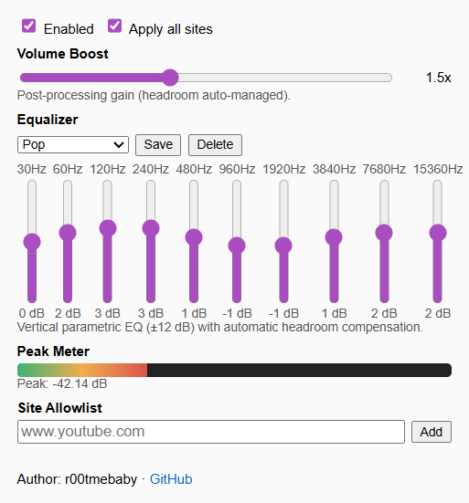

# Audio Normalizer & EQ (Chrome Extension)



A real-time audio normalizer and equalizer for Chrome that boosts loudness consistently across sites, provides a vertical Winamp-style parametric EQ, and shows live audio meters.

## Features

- **Loudness normalization** via DynamicsCompressor
- **10-band parametric EQ** (30Hz - 16kHz, ±12 dB per band)
- **7 Built-in presets**: Flat, Rock, Pop, Jazz, Classical, Bass, Vocal
- **Custom presets**: Save and load your own EQ settings
- **Dual audio meters**: 
  - Raw (pre-EQ) input level
  - Processed (post-EQ) with compression gain reduction indicator
- **Fast/Eco refresh modes**: Balance responsiveness (100ms) vs CPU usage (300ms)
- **Per-site control**: Apply to all sites or manage an allowlist
- **Privacy-focused**: No host permissions, uses `activeTab` + `scripting`

## Installation

### Developer Mode (Chrome)

1. Download or clone this repository:
   ```bash
   git clone https://github.com/r00tmebaby/Browser-Extensions.git
   cd Browser-Extensions/Normaliser
   ```

2. Open Chrome → More tools → Extensions (or navigate to `chrome://extensions/`)

3. Enable **"Developer mode"** (toggle in top-right corner)

4. Click **"Load unpacked"** and select the `Normaliser/` folder

5. The "Audio Normalizer & EQ" icon appears in your toolbar

### From Chrome Web Store (Coming Soon)

Extension is pending review for Chrome Web Store publication.

## Usage

1. **Open the extension**: Click the extension icon while audio/video is playing
2. **Adjust volume**: Use the vertical volume slider to boost audio (0.1x - 3.0x)
3. **Choose EQ preset**: Select from dropdown (Rock, Pop, Jazz, etc.) or use Flat
4. **Fine-tune EQ**: Drag vertical sliders for each frequency band
5. **Save custom preset**: Click "Save Preset" to store your settings
6. **Monitor audio**: Watch the dual meters for input level and compression
7. **Settings tab**: 
   - Toggle extension on/off
   - Choose "All sites" or manage allowlist
   - Add specific domains for processing

## Testing & Development

### Run Tests

```bash
# Install dependencies
npm install

# Run unit tests
npm test

# Run E2E tests (opens Chrome)
npm run test:e2e

# Run all tests with verification
npm run test:all

# Watch mode (auto-run on save)
npm run test:watch

# Coverage report
npm run test:coverage
```

### Test Coverage

- **24+ unit tests**: Manifest validation, EQ presets, frequency bands, storage schema
- **6+ E2E tests**: Real browser testing, audio detection, multi-site compatibility
- **Automated CI/CD**: Tests run on every push via GitHub Actions

See `tests/README.md` for detailed testing documentation.

### Build for Production

```bash
# Verify extension is valid
npm run verify

# Create .zip package for Chrome Web Store
npm run package
```

## Technical Details

### EQ Frequency Bands

| Band | Frequency | Range      |
|------|-----------|------------|
| 1    | 30 Hz     | Sub-bass   |
| 2    | 60 Hz     | Bass       |
| 3    | 125 Hz    | Low-mid    |
| 4    | 250 Hz    | Mid        |
| 5    | 500 Hz    | Mid        |
| 6    | 1 kHz     | Mid-high   |
| 7    | 2 kHz     | Presence   |
| 8    | 4 kHz     | Brilliance |
| 9    | 8 kHz     | Highs      |
| 10   | 16 kHz    | Air        |

### Audio Processing Chain

```
Source → Raw Meter → EQ → Compressor → Volume → Processed Meter → Output
```

### Permissions Explained

- **`activeTab`**: Access current tab only when you click the icon
- **`scripting`**: Inject audio processing code into the page
- **`storage`**: Save your EQ presets and settings

**No `host_permissions`**: Extension doesn't auto-inject on every site, ensuring faster Chrome Web Store review.

## Notes

- Some sites restrict access to detailed audio data; meters still show peaks using time-domain data
- For best results, play audio or interact with the page so the AudioContext can run
- Re-open the popup after changing tabs to re-inject audio processing
- Avoid extreme EQ boosts + high volume to prevent distortion

## Troubleshooting

| Issue | Solution |
|-------|----------|
| No audio processing | Click popup icon to inject into current tab |
| Meters not moving | Play audio, interact with page |
| Distortion | Lower volume boost or EQ gains |
| Not working after tab change | Re-open popup |
| Extension not loading | Check `chrome://extensions/` for errors |

## Privacy Policy

See [privacy-policy.md](privacy-policy.md) for full details.

**Summary**: All processing is local. No data collection. No external communication.

## Author

**r00tmebaby**

- GitHub: [r00tmebaby/Browser-Extensions](https://github.com/r00tmebaby/Browser-Extensions/tree/master/Normaliser)
- License: MIT

---

Built with ❤️ using Web Audio API
